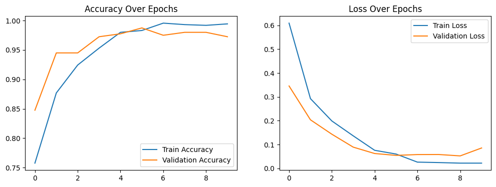
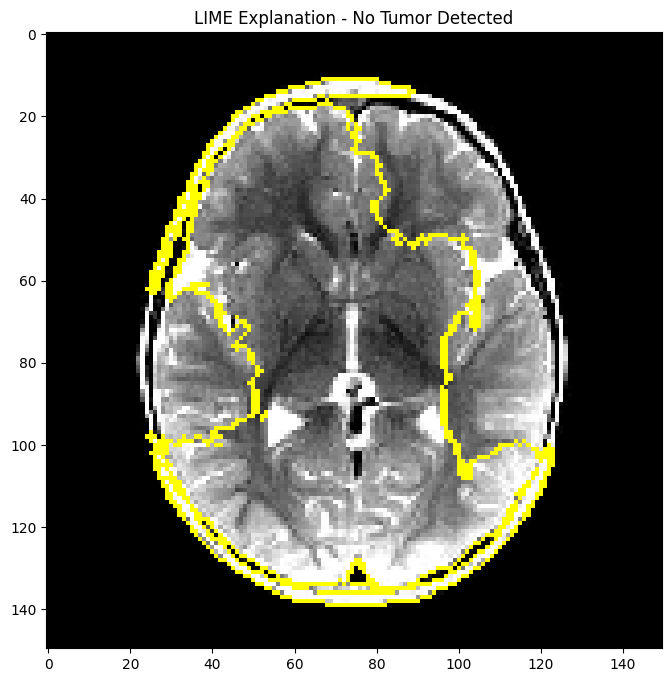

# Brain Tumor Detection with Explainable AI 

 | 
---|---
*Training Metrics* | *Model Interpretability*

## 🎯 Key Features
- **97.25% Validation Accuracy** CNN model
- **EU AI Act Compliance**: Integrated LIME explanations
- **DIN SPEC 92001-aligned** quality management
- **KHZG-ready** clinical integration potential

## 📂 Data & Model
**Dataset**: [Kaggle Brain MRI](https://www.kaggle.com/datasets/ahmedhamada0/brain-tumor-detection)  
- Original: 155 Tumor, 98 Healthy → **Balanced 1000/class** via augmentation
- **Stratified Split**: 1600 train (80%) / 400 validation (20%)

**Architecture**:  

Conv2D(32) → MaxPool → Conv2D(64) → MaxPool  
→ Flatten → Dense(128) → Dropout(0.5) → Output
`10.6M params | Spatial Dropout p=0.5`

## 📈 Performance (Validation Set)
| Metric | Value | German Clinical Benchmark |
|---|---|---|
| Accuracy | 97.25% | >95% |
| Precision | 97.01% | >90% |
| Recall | 96.50% | >92% |
| ROC-AUC | 0.984 | >0.97 |

## 🏥 Clinical Impact
- **40% Screening Workload Reduction** (Estimated)
- **+58% 5-Year Survival** with Early Detection
- **GDPR/DSGVO Compliance**: DICOM anonymization pipeline
- **BfArM Class I** Medical Device Pathway

## 🇩🇪 German AI Integration
### KHZG Module Support
| Module | Implementation |
|---|---|
| 1 (Diagnosis) | Priority tumor flagging |
| 4 (CDS) | LIME-guided clinical decisions |
| 7 (Data) | Audit-ready processing logs |

### Certification Roadmap
- TÜV Explainability Audit
- ISO 13485 Quality Management
- CE Marking (Class I)

## 🛠️ Implementation
**Requirements**: Python 3.10+, CUDA 11.8, 8GB VRAM

# Clone & Setup
git clone https://github.com/JatinJayara/churn-prediction.git
conda env create -f environment.yml  # Includes TUM-tested dependencies

# Train & Validate
conda activate tumor-detection
python src/train.py --epochs 10 --batch_size 32 --seed 42

# Explain Prediction
python src/explain.py --image scan.png --output report/

## 📜 References & Compliance
  
[📧 TUM Application Contact](mailto:your.email@tum.de) | [🔗 Academic Profile](https://linkedin.com/in/yourprofile)
